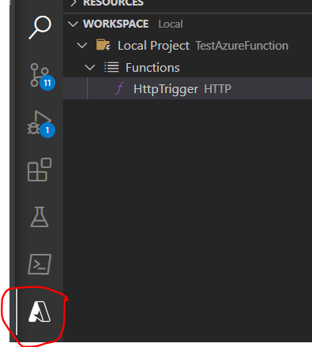
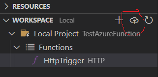

# Echo function

+ Open Visual Studio code
+ In the command palette (Ctrl+Shift+P) type Azure Function: Create new project
    + Choose Browse and select the already existing `HttpTrigger` folder in the project root
    + Select Python and ModelV2
    + Select the Http trigger template
    + Use `HttpTrigger` as name for the Http trigger
    + Select `Anonymous` as Authorization level
    + The `HttpTrigger` folder should now be populated with an Azure Function
+ Open the `HttpTrigger/function_app.py` File
+ Press F5 to test the echo function (it runs locally in a function emulation), alternatively use `func host start` from the nix development environment
+ Test your endpoint by calling http://localhost:7071/api/HttpTrigger?name=test
    + You can use the HttpClient by opening `request.http` and then using (Ctrl+Shift+P) and "Send Request" to send the Request 

# Create azure function
+ In the command palette (Ctrl+Shift+P) type Azure Function: Create function app in Azure
+ Select your subscription
+ Enter a name for your function app. The name needs to be globally unique.
+ Select Python 3.11 as runtime stack
+ Select West Europe (shouldn't be that important)
+ Wait until the function app is created

# Upload to azure function
+ Open the azure tab
+ 
+ Click the upload button
+ 
+ Select the subscription
+ Select your function app (if it is not visible in the resource field, restart VS Code and retry)
+ Click deploy
+ Wait until everything is deployed 
+ Test your endpoint by calling https://<name_of_your_function_app>.azurewebsites.net/api/httptrigger?name=test

+ Go to portal.azure.com -> Navigate to your function app and experiment a little bit what you can see there -> Monitoring, Executions, ...
