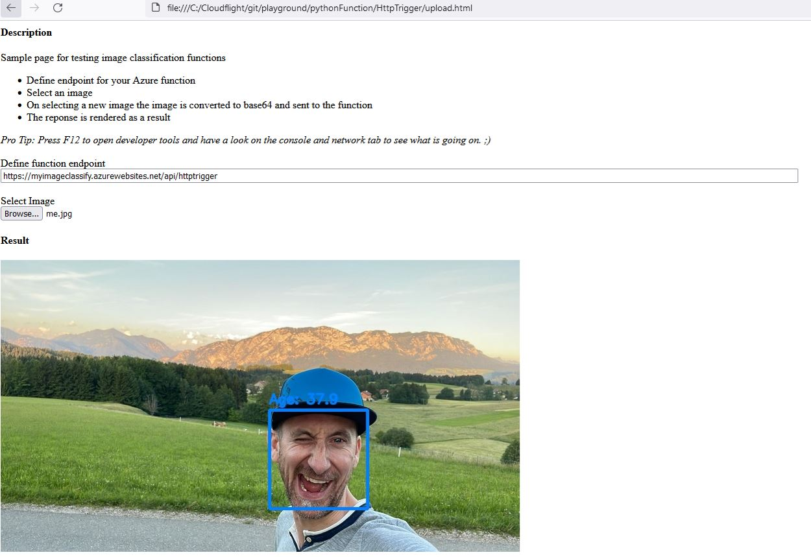

# Azure with Machine Learning Workshop

Welcome to the Azure with Machine Learning workshop! This repository contains the code and instructions for an
interactive coding session focused on cloud-native development on Azure, serverless functions, and machine learning.

## Project Overview

In this project, you'll create a serverless Azure function that integrates with a machine learning model. The function
will accept an image upload and return information about the image, such as age and emotions.



## Prerequisites

Before you begin, ensure you have the following:

### Find a Team
- This is a Team Exercise. Form Groups of 2-3 students.

### Azure Account

- Each team needs a free Azure account:
    - Create Azure Account https://azure.microsoft.com/free/?ref=microsoft.com&utm_source=microsoft.com&utm_medium=docs&utm_campaign=visualstudio
    - If eligible, use the Azure for Students offer. https://azure.microsoft.com/en-gb/free/students/

### Tools and Software

#### Automatic Setup
- If you have `nix` installed, use the flake: from project-root run `nix development`. Everything will be set up for you. You can use the `setup.sh` script to install `nix`.

#### Alternatively

- **Azure CLI**: Install Azure CLI https://learn.microsoft.com/en-us/cli/azure/install-azure-cli
- **Azure Functions Core Tools**: Install Azure Functions Core Tools https://docs.microsoft.com/en-us/azure/azure-functions/functions-run-local?tabs=v4%2Cwindows%2Ccsharp%2Cportal%2Cbash#install-the-azure-functions-core-tools
- **Visual Studio Code**: Download Visual Studio Code https://code.visualstudio.com/
    - Install these extensions:
        - REST Client https://marketplace.visualstudio.com/items?itemName=humao.rest-client
        - Python https://marketplace.visualstudio.com/items?itemName=ms-python.python
        - Azure Functions https://marketplace.visualstudio.com/items?itemName=ms-azuretools.vscode-azurefunctions
- **Python 3.11 on PATH**: Download Python 3.11 https://www.python.org/downloads/release/python-3110/
    - Install these Python packages:
        - `azure-functions`
        - `opencv-python`
        - `onnxruntime`
        - `numpy`
    - Set up a virtual environment in the `./HttpTrigger` directory:
      ```bash
      python3.11 -m venv .venv
      ```

## Getting Started

Follow these steps to set up and run the project:

1. **Login to Azure**

- Open the terminal in Visual Studio Code and run:
  ```bash
  az login
  ```
- This will open a browser window for you to log in.

2. **Set Up the Project**

- Clone this repository and navigate to the project directory.
- Open the folder starting with `01` in Visual Studio Code.
- Follow the instructions in the subsequent folders (`02`, `03`, etc.).

## Troubleshooting

If you encounter any issues, please reach out to us for assistance. We're here to help you succeed!
